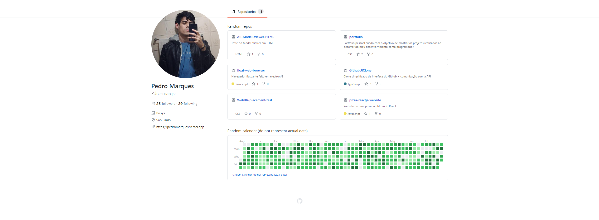
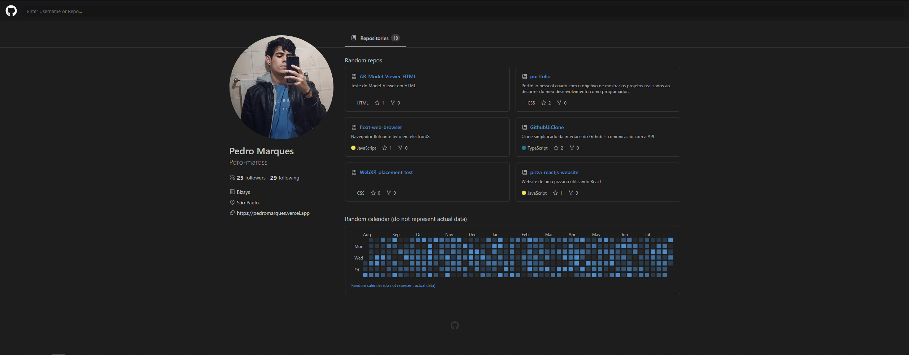
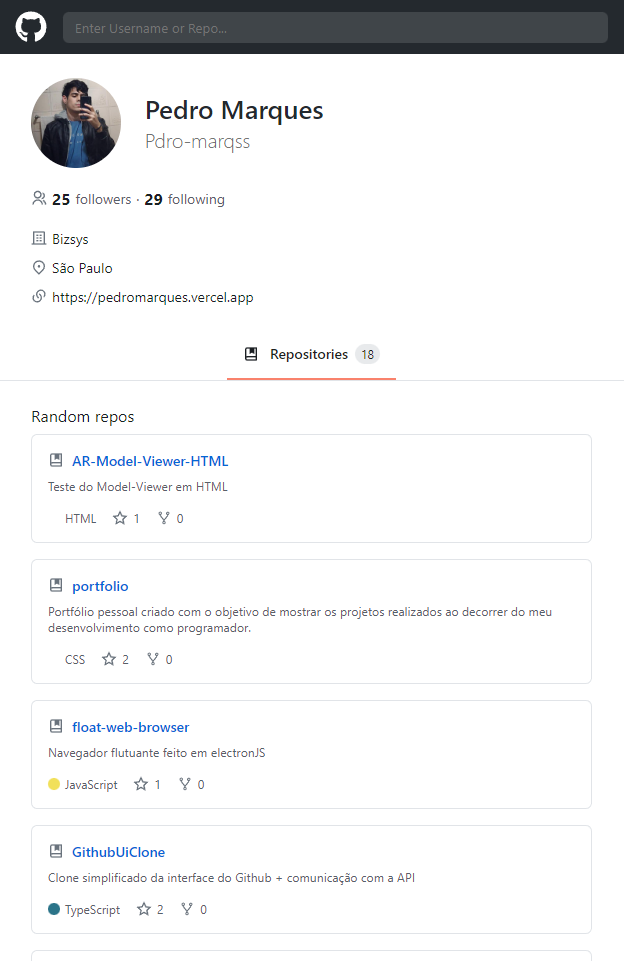
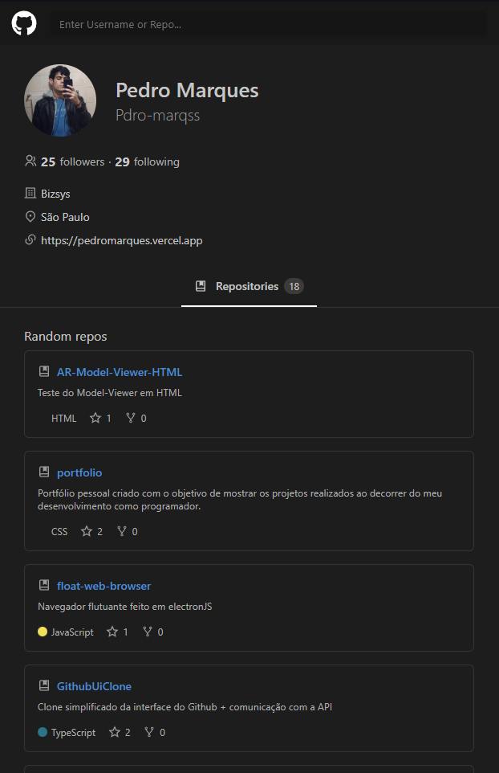

# Clone simplificado da UI do Github

Esse é um clone simples com os principais elementos da interface do Github. Usa a API para buscar por usuarios e mostrar alguns repositórios com dados reais de stars, forks dentre outros. Possui também um Dark mode que pode ser ativado clicando no icone do Github no canto superior esquerdo.

Esse projeto tem como principal objetivo o estudo do TypeScript junto a algumas outras tecnologias e bibliotecas descritas mais abaixo.


---

## Resultado final
### web
<p align="center">
    
    
</p>

### mobile
<p align="center">
    
    
</p>

---

## Como executar o projeto:
```bash
# Clone este repositório
$ git clone https://github.com/Pdro-marqss/GithubUiClone.git

# Instale as dependências
$ npm install

# Execute a aplicação 
$ npm start

```

---


## Tecnologias

As seguintes ferramentas foram usadas na construção do projeto:
- [React](https://pt-br.reactjs.org/)
- [TypeScript](https://www.typescriptlang.org/)
- [Styled-Components](https://styled-components.com);
- [React-Router-Dom](https://v5.reactrouter.com/web/guides/quick-start);
- [Fetch API](https://developer.mozilla.org/pt-BR/docs/Web/API/Fetch_API);
- [React-icons](https://react-icons.github.io/react-icons/);
- [Date-fns](https://date-fns.org).


